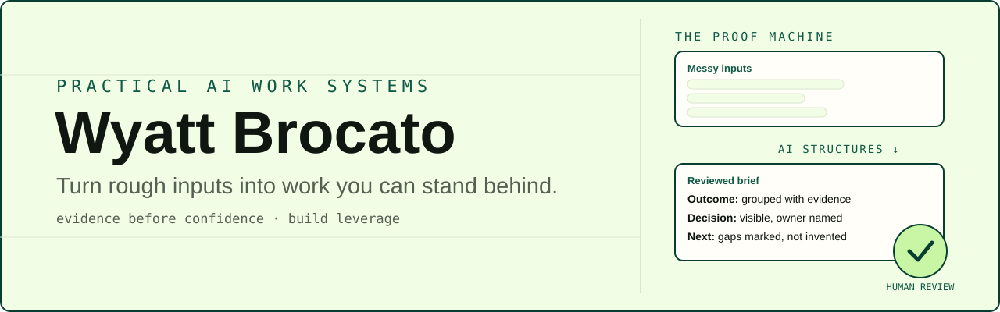

  

# Wyatt Brocato

I build practical AI work systems for experienced professionals: rough inputs become work you can stand behind, with context, risk, and approval staying human.

## Start here

- **[csm-kit][csm-kit]**: an offline Node.js CLI that turns CRM, ticket, and
  usage exports into source-cited renewal, handoff, and QBR briefs. See a
  [generated renewal brief][csm-output].
- **[5-Task Swap][task-swap]**: a no-login diagnostic that turns one recurring
  task into an explained fit assessment and a bounded 15-minute experiment.

## Selected work

- **[csm-kit][csm-kit]**: evidence-cited Customer Success briefs with explicit
  evidence gaps instead of unsupported claims.
- **[Subscribe Page][subscribe]**: a focused signup surface for The AI Business
  Playbook. Live; source is not public.
- **[Personal site][website]**: the product narrative connecting my operating
  method, worked example, diagnostic, and newsletter. Live; source is not
  public.
- **Scam First Aid**: browser-only post-scam triage and family conversation
  scripts. Shipped; the public GitHub mirror and live link are not yet
  verified.
- **AI Leverage Field Guide**: interactive, role-based workflow guides with
  local progress tracking and explicit human-review boundaries. Shipped; the
  public GitHub mirror and live link are not yet verified.

## Now

- **Focus:** practical systems for Customer Success, workflow design, and
  evidence-led decisions.
- **Current builds:** CSE Command Center, CCFT, and developer bootstrap.
  I don't link private repos, and I don't imply public source where none is
  verified.
- **Public transition:** GitHub is active again, but it is not yet a complete
  mirror of my public [GitLab work][gitlab].
- **Point of view:** use automation for structure and repetition; keep context,
  risk, and approval human.
- **Pins:** pin choices follow the [pinned-project guidance](PINNING.md).

## Find me

[][website]
[][subscribe]
[][linkedin]
[][gitlab]

*Evidence before confidence. Build leverage.*

[csm-kit]: https://github.com/thewyattbrocato/csm-kit
[csm-output]: https://github.com/thewyattbrocato/csm-kit/blob/main/examples/example-renewal-brief.md
[gitlab]: https://gitlab.com/wcbrocato
[linkedin]: https://www.linkedin.com/in/wyattbrocato/
[subscribe]: https://ai-business-playbook-subscribe.netlify.app/
[task-swap]: https://ai-business-playbook-task-swap.netlify.app/
[website]: https://wyattbrocato.site/
